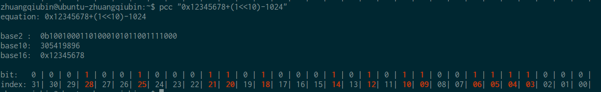

# python_console_calculate

## What is python_console_calculate
python_console_calculater is a simple python script to
help do calculate in console with python, then show result
in multiple format, like Hex / decimal / octal / binary.
we can also make our customize format, like show each
bit with index and mark all '1' to red, that's good
for some one who need to check the register.

## How to use
download from github
```bash
git clone git@github.com:zqb-all/python_console_calculater.git
cd python_console_calculater
```
then just call the script with your expression
```bash
./console_calculater.py 1+1
```
you can add alias, such as pcc
```bash
echo "alias pcc='$(pwd)/console_calculater.py'" >> ~/.bashrc
source ~/.bashrc
pcc 1+0x10
```
## Example


# python_console_calculate 中文版本说明

## python_console_calculate 是什么
python_console_calculate 是一个简单的python脚本, 用于辅助在控制台
使用python进行计算，然后将结果用多种格式显示出来，例如十六进制，
十进制，八进制，二进制。
我们还可以自行定制格式，例如将每个比特和序号一起显示，并将所有的
'1'显示为红色。这对于需要检查寄存器的人是很有用的。

## 如何使用
从github下载
```bash
git clone git@github.com:zqb-all/python_console_calculater.git
cd python_console_calculater
```

然后调用脚本并传入表达式即可
```bash
./console_calculater.py 1+1
```

你可以添加alias，例如jisuan
```bash
echo "alias jisuan='$(pwd)/console_calculater.py'" >> ~/.bashrc
source ~/.bashrc
jisuan 1+0x10
```
